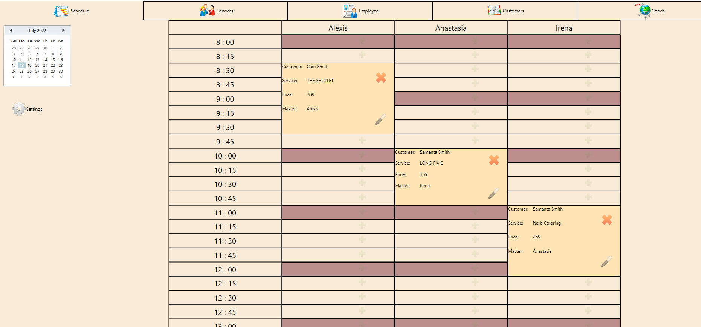
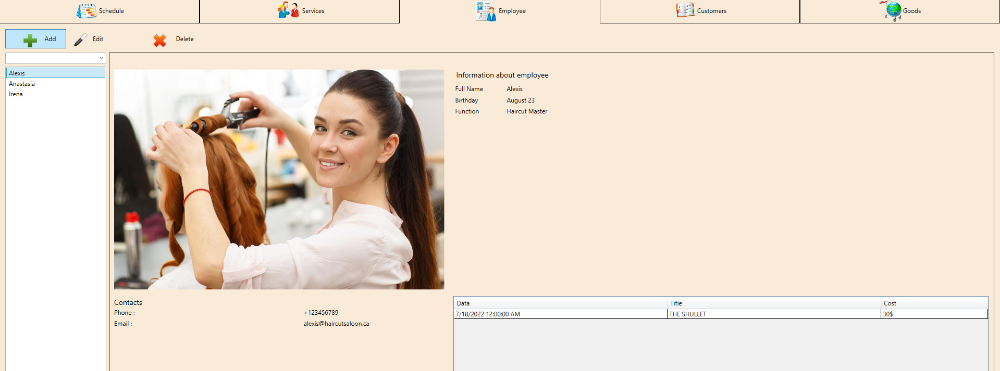

# Beauty salon MeiMei
> Desktop app for Beauty salon MeiMei.  

## Table of Contents
* [General Info](#general-information)
* [Technologies Used](#technologies-used)
* [Features](#features)
* [Screenshots](#screenshots)
* [Project Status](#project-status)
* [Acknowledgements](#acknowledgements)
* [Contact](#contact)

## General Information
- All features and workflows were agreed with the customer.
- The design was made from the scratch.
- The C# and MVVM pattern was choosen due to requirements have it as desktop application.

## Technologies Used
- C# WPF MVVM Pattern
- SQL Entity Framework

## Features
- Schedule appointment for each available master 
- Track master's productivity 
- User can see customers details and history 
- Goods for beauty industry can be sold and recorded as small shop in saloon.

## Screenshots

<!-- If you have screenshots you'd like to share, include them here. -->

## Project Status
Project is: _complete_.

## Acknowledgements
This project is owned by MeiMei beauty salon and displaid only for portfolio purpose as was agreed.

## Contact
Created by [@KirillKriachenko](https://github.com/KirillKriachenko) - feel free to contact me!
